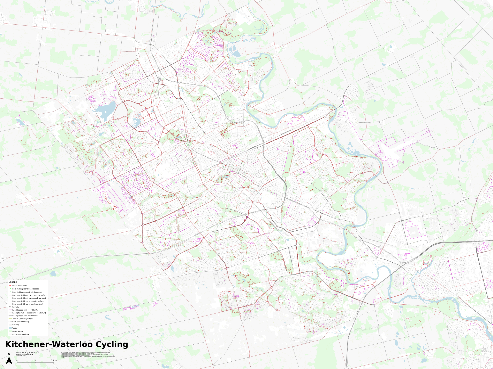

Kitchener-Waterloo Cycling Map
==============================

A map of Kitchener, ON, Canada and Waterloo, ON, Canada, designed with cycling in mind. The map prominently marks:

* Low-speed-limit and high-speed-limit roads.
* Cycling infrastructure separated into simple "cycling with cars" and "cycling without cars" categories.
* Surface materials suitable for road, gravel, or mountain bicycles.
* Bike parking and public washrooms, including access-controlled secure bicycle lockers.
* Elevation contours at 10 meter intervals.

# [View Webmap](https://anthony-zhang.me/kw-cycling-map/)

Low-resolution map preview:

Because we combine data directly from multiple regional and municipal open data initiatives, this map has more comprehensive and up-to-date coverage than Google Maps or OpenStreetMap.

Using the Map
-------------

### View the webmap online

We've [published an interactive browser-based version of the map](https://anthony-zhang.me/kw-cycling-map/) for easy access. However, this won't work offline and depends on us paying for hosting every month to continue being available.

### Download as an image

Download the [full-resolution PNG version (57598px width, 43198px height, ~324MB)](https://github.com/Uberi/kw-cycling-map/releases/download/v1.0.0/full-res-map.png). You may need to use specialized image viewers that can handle extremely large images - GIMP is one good option, though Firefox and Chromium work surprisingly well too.

The image version is designed to be printed as a 4ft wide by 3ft high poster at 1200dpi. You may find it useful as a starting point for your own prints.

### Host the webmap online or offline

Download the [webmap as a ZIP archive (~1.7 GB, ~46k files)](https://github.com/Uberi/kw-cycling-map/releases/download/v1.0.0/webmap.zip) and extract it. Some use cases:

* Host the directory locally with any static webserver: `python3 -m http.server`. Now visit `http://localhost:8000` to view an interactive version of the map in your web browser! This also works on mobile if you'd like to have the map available offline on-the-go (e.g., using [ServeIt](https://f-droid.org/en/packages/com.example.flutter_http_server/) on Android, [WorldWideWeb](https://apps.apple.com/us/app/worldwideweb-mobile/id1623006812) on iOS).
* Host the directory on blob storage or static file hosts such as AWS S3 or DigitalOcean Spaces. Note that many popular static hosting providers limit your uploads to ~1GB and ~10k files, which makes them unsuitable for hosting this map.
* Depending on your browser, you may be able to just open `index.html` in your browser and see the map. On Ubuntu 22.02 with the Chromium snap package, this works when the directory is somewhere inside the `~/Downloads` folder, but not anywhere else, due to the way the snap package sandboxes filesystem access.

### Customize the map for your own needs, or contribute directly to this map

Clone this repo and open `bike-map.qgz` with QGIS 3.22+. Some notes:

* The [QuickOSM plugin for QGIS](https://plugins.qgis.org/plugins/QuickOSM/) is useful if you want to import any other OpenStreetMap data that's not already in there
* The [Map Printer plugin for QGIS](https://plugins.qgis.org/plugins/MapsPrinter/) is useful if you want to export all of the print layouts at once rather than one-at-a-time.
* To export the low-resolution PNG version, there is a "Full" layout in the project that should be exported at 50dpi.
* To export the full-resolution PNG version, you'll run into a [QGIS issue limiting image dimensions to 32768px in either dimension](https://github.com/qgis/QGIS/issues/41045). To work around this, the project contains four layouts ("Top Left", "Bottom Left", "Top Right", and "Bottom Right") that split the map into four quandrants (each smaller than 32768px in either dimension) - export each of these layouts individually, then stitch them together by hand in GIMP to produce the final image.
* To export the webmap version, use "Processing Toolbox" -> "Raster tools" -> "Generate XYZ tiles (Directory)", with minimum zoom 10, maximum zoom 17, white background color, JPG tile format at 90% quality, 1024x1024 tile size, output the tiles into `./webmap/tiles`, and skip the Leaflet HTML output. View the generated tiles with `./webmap/index.html` once the export is complete.

Data Sources
------------

* [SOLRIS 3.0 land cover dataset](https://geohub.lio.gov.on.ca/documents/lio::southern-ontario-land-resource-information-system-solris-3-0/about), available under the [Open Government Licence v1.0 - Ontario](https://www.ontario.ca/page/open-government-licence-ontario)
    * This covers all of Southern Ontario, classifying the land at each point into one of 32 categories. The latest revision of the data, from 2015, was captured by [LandSat-8's Operational Land Imager](https://landsat.gsfc.nasa.gov/satellites/landsat-8/), with a resolution of about 30m. In SOLRIS 3, each data point represents an area of 0.5 hectares (5000 square meters).
    * Outside of Kitchener and Waterloo, the raster land cover dataset is rendered with nature in light green, mining/agriculture/unknown in light gray, and water in light blue (all other categories are either ignored or not present in this part of Ontario).
    * Within Kitchener and Waterloo, mining/agriculture/unknown is rendered in light gray, and everything else is ignored or not present in this part of Ontario. This is because the parks and water bodies datasets cover those already, and are vectors too for smoother rendering.
    * While we could instead obtain undisturbed nature and water from OpenStreetMap, it seems more geared toward officially designated and named parks rather than any kind of nature that's worth exploring. Mining/agricultural land coverage would also be difficult to obtain this way, as a lot of it isn't directly present on OpenStreetMap.
    * Kitchener publishes a [land cover dataset](https://open-kitchenergis.opendata.arcgis.com/documents/KitchenerGIS::land-cover-2019-kitchener-tif/about), but not Waterloo or any of the surrounding regions, so although the SOLRIS dataset is more difficult to work with due to its large size, it's necessary for complete coverage.
* Region of Waterloo official open datasets, available under the [Region of Waterloo Open Data Licence v2.0](https://www.regionofwaterloo.ca/en/regional-government/open-data.aspx#Open-Data-Licence):
    * [Building footprints](https://rowopendata-rmw.opendata.arcgis.com/datasets/RMW::building-footprints-1/about)
        * Rendered as light gray polygons.
    * [Contours](https://rowopendata-rmw.opendata.arcgis.com/datasets/RMW::contours-2014/about)
        * Rendered as olive lines at 10m intervals.
    * [Cities and towns](https://rowopendata-rmw.opendata.arcgis.com/datasets/RMW::cities-and-towns/about)
        * Boundaries of each city/town rendered as light gray dashed lines.
    * [Roads](https://rowopendata-rmw.opendata.arcgis.com/datasets/RMW::-roads/about)
        * Rendered as standard gray lines, except slow roads (speed limit <= 40km/h) are highlighted in magenta.
        * Some of the speed limits in this dataset seem to be higher than they should be - for example, Westfield Drive has a 50km/h speed limit according to the dataset, but cross-referencing with Google Maps Street View, there's a 40km/h speed limit sign from 2023 for that road. However, none of the speed limits were lower than they should be, in my spot checks.
        * We're somewhat hackily assuming that the to-scale width of the road is 4 meters times the number of lanes.
    * [Cycling](https://rowopendata-rmw.opendata.arcgis.com/datasets/RMW::cycling/about) and [Trails](https://rowopendata-rmw.opendata.arcgis.com/datasets/RMW::trails-2/about)
        * Rendered as light red lines for paths that are shared with automotive traffic, and dark red lines for paths that are not. The dark red lines are separated into a different layer so they always render on top of any light red lines. Smooth, even surfaces like asphalt and concrete are rendered with solid lines (ideal for road bikes), while rougher surfaces like gravel and dirt (or unknown surface materials) are rendered with dashed lines.
        * These two are missing a lot of smaller or newer bicycle paths in Kitchener and Waterloo that are in the Kitchener and Waterloo cycling datasets, so they're insufficient on their own, but they provide coverage outside of the two cities. Also, even within Kitchener and Waterloo, they contain a few bicycle paths that aren't in the other datasets, such as the trails around Laurel Creek Reservoir in Waterloo and inside Brigadoon Woods in Kitchener. We overlay this with the other cycling datasets to get more complete coverage.
* City of Kitchener official open datasets, available under the [Open Government License - The Corporation of the City of Kitchener](https://www.kitchener.ca/en/council-and-city-administration/open-data-licence.aspx):
    * [Active transportation](https://open-kitchenergis.opendata.arcgis.com/datasets/KitchenerGIS::active-transportation/about)
        * Rendered as light red lines for paths that are shared with automotive traffic, and dark red lines for paths that are not. The dark red lines are separated into a different layer so they always render on top of any light red lines. Smooth, even surfaces like asphalt and concrete are rendered with solid lines (ideal for road bikes), while rougher surfaces like gravel and dirt (or unknown surface materials) are rendered with dashed lines.
        * The [cycling infrastructure](https://open-kitchenergis.opendata.arcgis.com/datasets/KitchenerGIS::cycling-infrastructure-1/about) and [trails](https://open-kitchenergis.opendata.arcgis.com/datasets/KitchenerGIS::trails/about) datasets are both derived from this dataset according to their metadata - the cycling infrastructure dataset filters by `STATUS = 'ACTIVE' AND OWNERSHIP <> 'PRIVATE' AND (CATEGORY = 'CYCLING' OR SUBCATEGORY = 'BMUT'`, while the trails dataset filters by `STATUS = 'ACTIVE' AND ( CATEGORY = 'PATHWAYS' OR (CATEGORY = 'CYCLING' AND route name 2 = 'THE GREAT TRAIL'))`. We use a query that's almost the same as the union of those two, except it also includes `OWNERSHIP = 'PRIVATE' AND CATEGORY = 'CYCLING'`.
        * This is combined with the Region of Waterloo cycling dataset to fill in some missing bicycle paths.
    * [Public washrooms](https://open-kitchenergis.opendata.arcgis.com/datasets/KitchenerGIS::public-washrooms/about)
        * Rendered as red bathroom symbols.
    * [Bike racks](https://open-kitchenergis.opendata.arcgis.com/datasets/KitchenerGIS::bike-racks/about)
        * Rendered as dark green parking symbols for regular public bike racks/hitches, or light green parking symbols for secure access-controlled lockers (Kitchener has [city-managed parking garages](https://www.kitchener.ca/en/parking/bike-parking.aspx) for free, with a one-time setup fee).
    * [Railway lines](https://open-kitchenergis.opendata.arcgis.com/datasets/KitchenerGIS::railway-lines/about)
        * Rendered as black rail-lines.
    * [Parks](https://open-kitchenergis.opendata.arcgis.com/datasets/KitchenerGIS::parks/about)
        * Rendered as light green polygons.
    * [Rivers, creeks, ponds, lakes](https://open-kitchenergis.opendata.arcgis.com/datasets/KitchenerGIS::river-creeks-ponds-and-lakes/about)
        * Rendered as light blue polygons.
    * [Roads](https://open-kitchenergis.opendata.arcgis.com/datasets/KitchenerGIS::roads/about)
        * Unlike the Region of Waterloo roads dataset, this seems to have accurate speed limits throughout Kitchener. However, many roads are missing their speed limit values (e.g., The Boardwalk), so this dataset also can't entirely replace the Region of Waterloo roads dataset within its coverage area.
        * Instead, we render the slow roads (speed limit at or under 40km/h) overlaid in magenta on the Region of Waterloo roads dataset. Since none of the speed limits in that dataset were lower than they should be, the overlaid version is then more accurate than either individual dataset.
        * For the to-scale width of the road, this dataset actually does contains the pavement width of the road, but for consistency with the other datasets, we still use the hacky 4 meters per lane assumption.
* City of Waterloo official open datasets, available under the [Waterloo Open Data User Licence](https://data.waterloo.ca/pages/open-data-licence):
    * [Cycling infrastructure](https://data.waterloo.ca/datasets/City-of-Waterloo::cycling-infrastructure/about) and [Trails and pathways](https://data.waterloo.ca/datasets/City-of-Waterloo::trails-and-pathways/about)
        * Rendered as light red lines for paths that are shared with automotive traffic, and dark red lines for paths that are not. The dark red lines are separated into a different layer so they always render on top of any light red lines. Smooth, even surfaces like asphalt and concrete are rendered with solid lines (ideal for road bikes), while rougher surfaces like gravel and dirt (or unknown surface materials) are rendered with dashed lines.
        * This is combined with the Region of Waterloo cycling dataset to fill in some missing bicycle paths.
    * [Bicycle parking](https://data.waterloo.ca/datasets/City-of-Waterloo::bicycle-parking/about)
        * Rendered as dark green parking symbols for regular public bike racks/hitches, or light green parking symbols for secure access-controlled lockers (Waterloo has [city-managed rental bicycle lockers](https://www.waterloo.ca/en/living/cycling.aspx#bicycleparking) for $10/mo plus tax).
    * [Railways](https://data.waterloo.ca/datasets/City-of-Waterloo::railways/about)
        * Rendered as black rail-lines.
    * [Parks](https://data.waterloo.ca/datasets/City-of-Waterloo::parks/about)
        * Rendered as light green polygons.
    * [Water bodies](https://data.waterloo.ca/datasets/City-of-Waterloo::water-bodies/about)
        * Rendered as light blue polygons.
    * [Roads](https://data.waterloo.ca/datasets/City-of-Waterloo::roads/about)
        * Unlike the Region of Waterloo roads dataset, this seems to have accurate speed limits throughout Waterloo. However, many roads are missing their speed limit values, so this dataset also can't entirely replace the Region of Waterloo roads dataset within its coverage area.
        * Instead, we render the slow roads (speed limit at or under 40km/h) overlaid in magenta on the Region of Waterloo roads dataset. Since none of the speed limits in that dataset were lower than they should be, the overlaid version is then more accurate than either individual dataset.
        * We're somewhat hackily assuming that the to-scale width of the road is 4 meters times the number of lanes.
* OpenStreetMap, available under the [Open Data Commons Open Database License](https://opendatacommons.org/licenses/odbl/1-0/):
    * Public washrooms in Waterloo, via Overpass query in the QuickOSM plugin:

            [out:xml] [timeout:25];
            {{geocodeArea:Waterloo, ON, Canada}} -> .area_0;
            (
                node["amenity"="toilets"](area.area_0);
            );
            (._;>;);
            out body;

Licensing
---------

Copyright 2024 Anthony Zhang (me@anthonyz.ca), and made freely available under the [Creative Commons Attribution 4.0 International license](https://creativecommons.org/licenses/by/4.0/). Sources and other details are available online at https://github.com/Uberi/kw-cycling-map

This map uses data from several sources credited above in the "Data Sources" section. Here are their corresponding attribution statements:

    Contains information licensed under the Open Government Licence - Ontario.
    Contains information licensed under the Open Government Licence - The Corporation of the City of Kitchener.
    Contains information provided by the City of Waterloo under licence.
    Contains information from OpenStreetMap, which is made available at openstreetmap.org under the Open Database License (ODbL).

Future Work
-----------

* Roads with traffic calming measures (speed bumps, raised crosswalks) can better guarantee that traffic on those roads flows at a lower speed, compared to roads that simply have a lower speed limit. We could visualize that by using the [Kitchener traffic calming dataset](https://open-kitchenergis.opendata.arcgis.com/datasets/2751362c6d5046d997fe166aa6f6e11a_0/about) and joining it with street segments, then rendering those in a new style representing "Road (designed for low speeds)". However, the dataset is only available for Kitchener, so we still need to find a Waterloo dataset to combine it with.
* A road's traffic accidents divided by traffic volume would be an interesting measure of how dangerous it is, which could then be joined with street segments and visualized as "dangerous streets". The [Kitchener traffic collisions dataset](https://data.waterloo.ca/datasets/75fa68b17e5b421d9d881f987c2d43fc_0/about) covers this, but we'd still be missing Waterloo, so instead we would have to directly use the [Waterloo Regional Police Occurrence Dataset](https://www.wrps.on.ca/en/about-us/reports-publications-and-surveys.aspx) (filter the incidents to those under the "MVC" category). The data could also be filtered for incidents specifically involving cyclists, though it seems like that would make the dataset too sparse to be useful.
* Would be really useful to visualize shortcuts, such as the large parking lot near Parkside Drive and Northfield Drive that you can cut through to get between Parkside Drive onto Market Trail. Probably need to use satellite/aerial imagery for this.
    * Kitchener: [Orthographic aerial imagery, 2021](https://open-kitchenergis.opendata.arcgis.com/documents/KitchenerGIS::aerial-imagery-2021-kitchener-sid/about)
    * Waterloo: [Orthographic aerial imagery, 2021](https://data.waterloo.ca/documents/City-of-Waterloo::aerial-imagery-2021/about)
    * Need a GDAL driver for MrSID raster support to be able to load these: https://gis.stackexchange.com/questions/136880/error-adding-mrsid-raster-layer-to-qgis-for-mac-os-x-10-10-2-yosemite
* GRT bus/rail routes, via the [Region of Waterloo GRT routes dataset](https://open-kitchenergis.opendata.arcgis.com/datasets/RMW::grt-routes-2/about)
